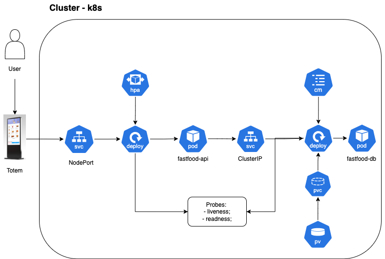

# CHALLENGE SOAT8 - GRUPO 35

## Conteúdo

- [Sobre](#sobre)
- [DDD - Event Storming](#ddd---event-storming)
- [Gerenciamento das tarefas](#gerenciamento-das-tarefas)
- [Arquitetura](#arquitetura)
- [Como rodar a aplicação - Kubernetes](#como-rodar-a-aplicação-com-kubernetes)
- [Como rodar a aplicação - Docker](#como-rodar-a-aplicação-com-docker)
- [Video demonstração](#video-de-demonstração)
- [Contribuidores](#contribuidores)

## Sobre

Neste primeira fase desenvolvemos uma projeto para o curso de Pós Graduação em Software Architecture da FIAP com os requisitos solicitados no [Challenge](https://on.fiap.com.br/mod/conteudoshtml/view.php?id=407435&c=11255). Foi desenvolvido pelo **Grupo 35** da **SOAT8**.


## DDD - Event Storming

Disponibilizamos através deste [link](https://miro.com/app/board/uXjVK4xDf-w=/?share_link_id=428293472540) o Event Storming realizado pela equipe com todas etapas realizadas.

## Gerenciamento das tarefas

Para gerenciar as tarefas entre os membros da equipe utilizamos o Trello, nosso board está disponivel atraves deste [link](https://trello.com/invite/b/66959632140d514b6a763d28/ATTI2cd6e07d6daf09d518c1bfc0f711919845B21452/pos-grupo35-techchallenge-fase1).


## Arquitetura 




## Justificativa de escolha do Banco de dados

Definimos o uso do Banco de Dados Postgres no Amazon RDS, por trabalhar com modelo relacional, no qual entendemos ser a melhor abordagem para o nossa demanda, já que temos uma estrutura de dados bem organizada, facilidade de consultas com SQL e como lidamos com pagamentos, nos oferece mecanismos de integridade e controle de transações. Outro ponto importante na escolha é sua comunidade ativa, já que é um projeto *Open Source* e continua evoluindo conforme novidades vão surgindo e por este motivo também se encaixa perfeitamente em nosso orçamento, especialmente no tier gratuito do Amazon RDS.


## Como rodar a aplicação com Kubernetes

Para rodar a aplicação com Kubernetes é necessário instalar as seguintes ferramentas:

- Guia de instalação do [Docker](https://docs.docker.com/engine/install/)
- Guia de instalação do [Minikube](https://minikube.sigs.k8s.io/docs/start/)
- Guia de instalação do [Kubectl](https://kubernetes.io/docs/tasks/tools/)

Após instalação, inicie um cluster:
- `minikube start`

Com o cluster disponível, execute no diretório raíz:
- `sh kubernetes/kubernetes_up.sh`

Acesse o swagger:

- `http://localhost:32100/swagger/index.html`

## Como rodar a aplicação com Docker

Para rodar a aplicação, deve-se executar o comando:

```
docker-compose up
```

Para visualizar o **Swagger**, devemos manter a aplicação rodando e acessar a URL abaixo:

`http://localhost:8000/swagger/index.html`

<!-- 
# Rodar os testes

1. Instalação do gomock para execução dos testes localmente

```
go install go.uber.org/mock/mockgen@latest
```

2. Geração dos arquivos de mock preenchidos via go generate no projeto

```
go generate ./...
```

3. Execução dos testes do projeto

```
go test ./test/...
``` -->


## Video de Demonstração

- Video demonstrando as funcionalidades solicitadas na Fase 2: https://youtu.be/t0N95YRmOIw
- Video demonstrando as funcionalidades solicitadas na Fase 3: https://youtu.be/t0N95YRmOIw


## Contribuidores

- Egio Lima
- Gabriel Rosa Nunes
- Irlan Gomes
- Jhony Eduardo Senem